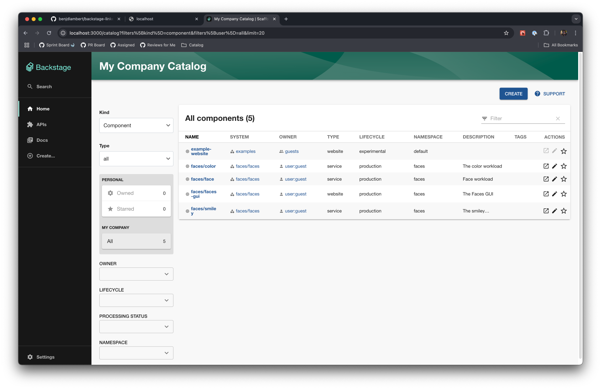
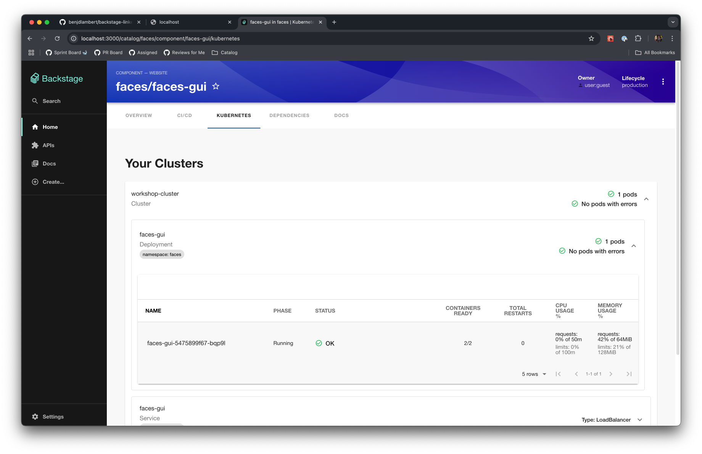
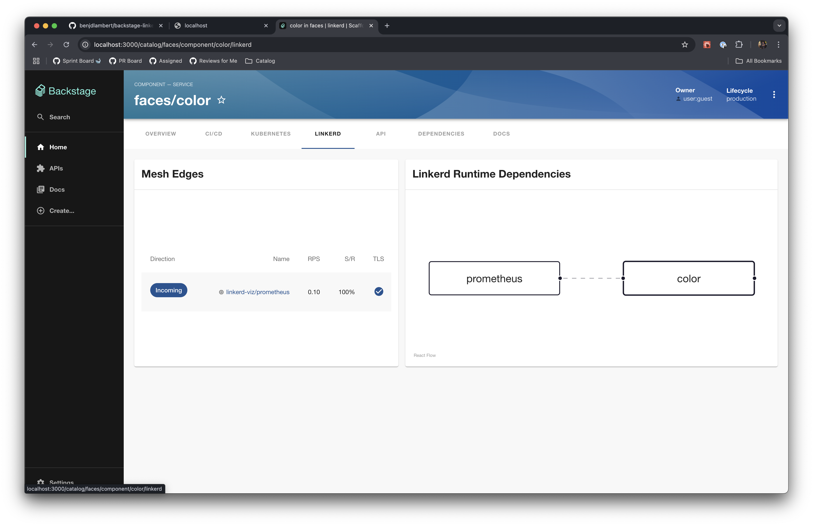

# linkerd + backstage workshop

### Prerequisites

Make sure that you've followed the setup guide for linkerd + backstage, and have a local backstage project using:

```bash
npx @backstage/create-app@latest
```

### Step 1: Populate the Catalog

First off, we're going to want to populate the catalog with some entities that we can use to visualize the linkerd service mesh. We're going to want to add some entities that are respective of the services that we have running in the cluster.

Let's look at a sample `catalog-info.yaml` file that we can use to populate the catalog:

```yaml
apiVersion: backstage.io/v1alpha1
kind: Component
metadata:
  name: linkerd
  description: The linkerd service mesh control plane
spec:
  type: service
  lifecycle: production
  owner: team-a
```

This represents a component in the Backstage Software Catalog, and you can read more about how to define your own Entities in the [Backstage documentation](https://backstage.io/docs/features/software-catalog/descriptor-format).

We need to represent what we already have running in the cluster in a `catalog-info.yaml` form, normally this would be stored alongside the code for your services with the relevant metadata just checked into the repo, but for the purposes of this demo, there's a file called [example-catalog.yaml](./example-catalog.yaml) that you can use to populate the catalog.

If we take a snippet from the demo file, you can see that first we defined the relevant Backstage metadata for an entity, as well as some other `annotations` which tell both the `kubernetes` plugin in Backstage and the `linkerd` one how to find the relevant resources in the cluster.

```yaml
apiVersion: backstage.io/v1alpha1
kind: Component
metadata:
  name: faces-gui
  description: The Faces GUI
  namespace: faces
  annotations:
    # this identifies the any resources in the cluster that have the label service: faces-gui in the cluster
    backstage.io/kubernetes-label-selector: service=faces-gui
    # this identifies the namespace the resources are running in
    backstage.io/kubernetes-namespace: faces
    github.com/project-slug: BuoyantIO/faces-demo
  links:
    - url: http://localhost/faces/
      title: Faces GUI
spec:
  type: website
  lifecycle: production
  owner: user:default/guest
  system: faces
```

Let's go and add this file to the Catalog, you do this by heading over the `app-config.yaml` file and adding a new location under `catalog.locations` that looks like the following:

```yaml
  - type: url
    target: https://github.com/benjdlambert/backstage-linkerd-workshop/blob/main/example-catalog.yaml
```



### Step -1: Install the Kubernetes Backend Plugin (if not already installed)

By default the Kubernetes plugin is already installed in new Backstage workspaces, but if you need help installing it in an existing workspace you can follow the below guide:

First off, from the Backstage workspace root, let's install the Kubernetes backend plugin:

```bash
cd packages/backend
yarn add @backstage/plugin-kubernetes-backend
```

And then we need to add the plugin to the backend. Open `packages/backend/src/index.ts` and add the following before `backend.start()`.

```ts
// Add in the kubernetes backend plugin
backend.add(import("@backstage/plugin-kubernetes-backend"));
```

### Step 1: Configure the Kubernetes Plugin

The Kubernetes plugin is going to act as a proxy so that we can communicate with the Kubernetes API, and proxy requests to the `linkerd viz` service and pods that are running with the control plane. We're going to want to configure this with a service account locally at least so that we can access the K8s API with a secure token, but this might be configured differently in a production environment.

Theres also some [extensive configuration documentation](https://backstage.io/docs/plugins/kubernetes/configuration) available on the Backstage.io microsite.

Included in this repo in the file [deployment-1.yaml](./deployment-1.yaml) is a Kubernetes deployment that will create a service account and a role that will allow the Backstage Kubernetes plugin to access the Kubernetes API. It also creates a secret so that we can get a token locally to communicate with a running cluster, so that we can run the linkerd and k8s plugins against a running cluster.

Now it's worth noting that these permissions are pretty broad, but they're read-only. You can adjust these permissions to be more restrictive if you'd like.

Let's apply the `deployment-1.yaml` first, to setup `namespace` and `service-accounts` for the Backstage application.

```bash
kubectl apply -f https://raw.githubusercontent.com/benjdlambert/backstage-linkerd-workshop/refs/heads/main/deployment-1.yaml
```

And then finally to get the token that we need to use to configure the Kubernetes plugin, we can run:

```bash
BACKSTAGE_SERVICE_ACCOUNT_TOKEN=$(kubectl -n backstage get secret backstage -o go-template='{{.data.token | base64decode}}')
```

We can run the above command with `export` at the beginning in the same terminal as the `yarn dev` command, and then update the config in `app-config.yaml` underneath the `k8s` section. You can run `kubectl config view --minify --output jsonpath='{.clusters[0].cluster.server}'` to find the server URL if you don't know it already.

```yaml
kubernetes:
  serviceLocatorMethod:
    type: multiTenant
  clusterLocatorMethods:
    - type: config
      clusters:
        - name: workshop-cluster
          authProvider: serviceAccount
          url: SERVER_URL
          serviceAccountToken: ${BACKSTAGE_SERVICE_ACCOUNT_TOKEN}
          skipTLSVerify: true
```

Now when we go to one of the entities we should see the Kubernetes tab on the entity page is populated with the pods and services that are deployed and running in the cluster.



### Step 2: Install the linkerd plugin

Now that we've got kubernetes running, we can install the linkerd plugin. We can do this by installing both the backend and frontend plugin.

Let's start with the frontend plugin:

```bash
cd packages/app
yarn add @backstage-community/plugin-linkerd
```

And then we need to add the components to the app. Open `packages/app/src/components/catalog/EntityPage.tsx` and add the following import:

```tsx
import {
  LinkerdDependenciesCard,
  LinkerdIsMeshedBanner,
  LinkerdEdgesTable,
} from "@backstage-community/plugin-linkerd";
```

And now we want to use these components in the relevant places. The `isMeshedBanner` can be placed inside the `entityWarningContent` like so:

```ts
const entityWarningContent = (
  <>
    <EntitySwitch>
      <EntitySwitch.Case if={isOrphan}>
        <Grid item xs={12}>
          <EntityOrphanWarning />
        </Grid>
      </EntitySwitch.Case>
    </EntitySwitch>
    <EntitySwitch>
      <EntitySwitch.Case if={hasRelationWarnings}>
        <Grid item xs={12}>
          <EntityRelationWarning />
        </Grid>
      </EntitySwitch.Case>
    </EntitySwitch>
    <EntitySwitch>
      <EntitySwitch.Case if={hasCatalogProcessingErrors}>
        <Grid item xs={12}>
          <EntityProcessingErrorsPanel />
        </Grid>
      </EntitySwitch.Case>
    </EntitySwitch>
    /* Add this block */
    <EntitySwitch>
      <EntitySwitch.Case if={isKubernetesAvailable}>
        <Grid item xs={12}>
          <LinkerdIsMeshedBanner />
        </Grid>
      </EntitySwitch.Case>
    </EntitySwitch>
  </>
);
```

And then the other cards can be added to a new tab in the `EntityPage.tsx` file:

```tsx
const serviceEntityPage = (
  <EntityLayout>
    <EntityLayout.Route path="/" title="Overview">
      {overviewContent}
    </EntityLayout.Route>

    <EntityLayout.Route path="/ci-cd" title="CI/CD">
      {cicdContent}
    </EntityLayout.Route>

    <EntityLayout.Route
      path="/kubernetes"
      title="Kubernetes"
      if={isKubernetesAvailable}
    >
      <EntityKubernetesContent />
    </EntityLayout.Route>
    ...

    /* Add this block */
    <EntityLayout.Route
      path="/linkerd"
      title="linkerd"
      if={isKubernetesAvailable}
    >
      <Grid container>
        <Grid item xs={5}>
          <LinkerdEdgesTable />
        </Grid>
        <Grid item xs={7}>
          <LinkerdDependenciesCard />
        </Grid>
      </Grid>
    </EntityLayout.Route>

```

So you should be able to see the `linkerd` tab on the entity page now, but you might see that it's telling us that the component is not meshed, this is a bit of a red herring, as it's actually because we haven't finshed setting up the linkerd plugin. There's also a backend plugin that we need to install which is going to be responsible for getting the metrics for the component.

Let's do that now and install the backend part.

```bash
cd packages/backend
yarn add @backstage-community/plugin-linkerd-backend
```

And then we need to add the plugin to the backend. Open `packages/backend/src/index.ts` and add the following before `backend.start()`.

```ts
// Add in the linkerd backend plugin
backend.add(import("@backstage-community/plugin-linkerd-backend"));
```

Thats it!

Now when you go to the entity page for the `linkerd` entity, you should see the `linkerd` tab populated with the edges and dependencies that are running in the cluster.



### Step 3: Let's deploy this to the cluster

No that we have everything working, we can try to go ahead and deploy this into the cluster.

In order to deploy what we have locally, we need to build a docker container with the current source, push this somewhere and then deploy a manifest to the cluster. There's also the potential to use the [helm chart](https://github.com/backstage/charts) that Backstage provides, but you'll still need a custom image to rollout.

First we need to clean up some config for the production build in `app-config.yaml`. 

In a real life production scenario, you'd want to configure a [proper login and auth provider](https://backstage.io/docs/auth/identity-resolver). But for the purposes of this demo, we're just going to carry on using the [Guest Auth provider](https://backstage.io/docs/auth/guest/provider), but by default it's disabled in production.

Firstly, we can go ahead and delete most of the contents of `app-config.production.yaml` as pretty much all of the config that we have so far will be re-used in production. Again, normally you would also configure a PostgreSQL database for the Backstage deployment, but we're just going to use the default inmemory `sqlite` database for this demo.

The `app-config.production.yaml` file should be cleaned, and have the following contents:

```yaml
# reconfigure the kubernetes plugin to remove the service account token
kubernetes:
  serviceLocatorMethod:
    type: "multiTenant"
  clusterLocatorMethods:
    - type: "config"
      clusters:
        - name: "workshop-cluster"
          authProvider: "serviceAccount"
          url: https://74.220.20.169:6443
          skipTLSVerify: true

# enable guest auth in production
auth:
  providers:
    guest:
      dangerouslyAllowOutsideDevelopment: true
```

Because the deployment that we're going to rollout later with the container is going to use the `backstage` service account directly instead of the service account secret token, we can drop the requirement to have that in the config in the production config.

We're also dangerously going to allow guest auth in production, which is not recommended, but for the purposes of this demo, it's fine, and we should really setup proper authentication.

Now we can go ahead and build the docker container:

```bash
yarn build:all

docker buildx build --platform=linux/amd64 -f packages/backend/Dockerfile -t benjaminl617/backstage-linkerd-workshop:2.0.0 .
docker push benjaminl617/backstage-linkerd-workshop:2.0.0
```
### Common problems:

Might run into issues locally with the `linkerd viz` service not being able to be proxied to a running cluster:

```json
{
  "error": {
    "name": "Error",
    "message": "Request failed with status 400 Bad Request, It appears that you are trying to reach this service with a host of '$IP_ADDRESS'.\nThis does not match /^(localhost|127\\.0\\.0\\.1|web\\.linkerd-viz\\.svc\\.cluster\\.local|web\\.linkerd-viz\\.svc|\\[::1\\])(:\\d+)?$/ and has been denied for security reasons.\nPlease see https://linkerd.io/dns-rebinding for an explanation of what is happening and how to fix it.\n"
  }
}
```

You'll need to edit the `linkerd-viz` `web` deployment to update or remove the `-enforced-host` flag. You can do this by running:

```bash
kubectl edit deployment -n linkerd-viz web
```

And searching for `-enforced-host`.
